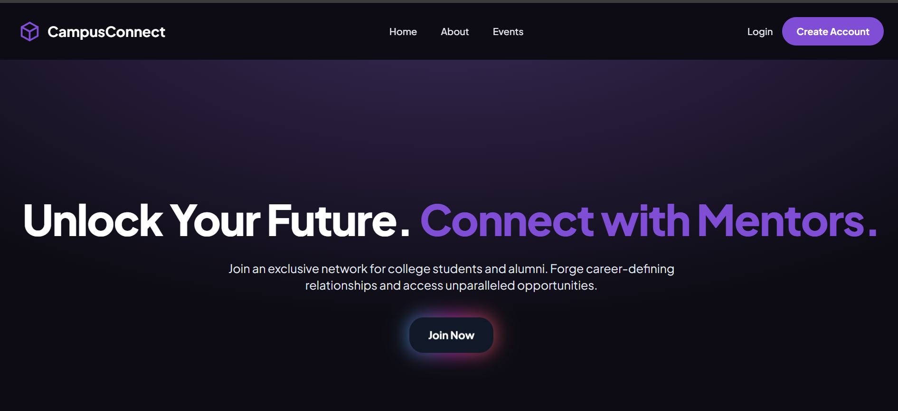
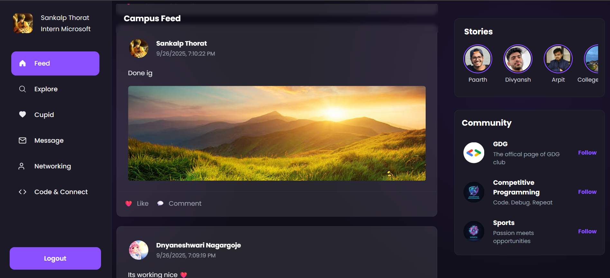

# 📚 CampusConnect – The Digital Heartbeat of Campus  

Welcome to **CampusConnect** – your one-stop hub for everything happening on campus! 🎓✨  
Think of it as **Twitter + LinkedIn + Tinder + GitHub stats**… but made *just for your college community*.  

## 🚀 What is CampusConnect?  

Campus life is more than just lectures and assignments. It’s about events, friendships, coding battles, networking, and sometimes… finding your secret crush 👀.  
CampusConnect brings **all of that** into one digital hood: a place where students and alumni can hang out, share, connect, and grow.  

-   

## 🌟 Features  

### 📝 Feed
> Keep the campus buzzing.  
- Post your thoughts, memes, notes, or even random rants.
- -   

### 🎉 Explore (Discover Campus Life)  
> Never miss a thing!  
- Browse all upcoming **events** and college fests.  
- Join or discover **clubs and groups**.  
- Showcase **projects** you’ve built and see what others are working on.
- -   

### 💘 Cupid  
> Love is in the air – but this time, it’s secret until it’s mutual! 
- Submit your **crush’s name** anonymously.  
- If they crush back → you both get matched 💖.  
- Matched users unlock **real-time private chat**.  
- Bonus: **Confession Board** 🤫 → Post anonymous confessions for everyone to see.
- 
-   

### 💬 Messaging  
> Stay connected with your campus circle. 
- **Real-time chat** with peers and alumni.  
- Only matched crushes or accepted connections can message.  
- Simple, fast, and private.  
-   

### 🌐 Network 
> Build your professional + personal circle.  
- Connect with **alumni and peers**.  
- Expand your professional network.  
- Perfect for mentorships, placements, and collaborations.  
-   

### 💻 Code-Connect (For Coders & Geeks)  
> Battle for glory on the coding leaderboard 💻🔥 
- See **top coders** across campus.  
- Compare your **GitHub, Codeforces, and LeetCode stats**.  
- Climb the leaderboard and get noticed.  
-   

### 🙋 Profile  
> Your vibe, your showcase.  
- Customize with **avatar + banner**.  
- Show off your **coding profiles & stats** (fetched via APIs).  
- A mini resume meets personal showcase.  
-   

## 🪪 Create Account Flow  

1. **Sign Up** → Make your CampusConnect account.  
2. **Edit Profile** →  
   - Add your **GitHub, Codeforces, and LeetCode links**.  
   - Upload your avatar and banner.  
   - Fill in your details (interests, about, etc.).  
3. Once your profile is set up:  
   - Post on the **Feed** 📝  
   - Play **Cupid** 💘  
   - Explore events, projects & clubs 🎉  
   - Check the **coder leaderboard** 💻  
   - Start networking 🌐  

---

